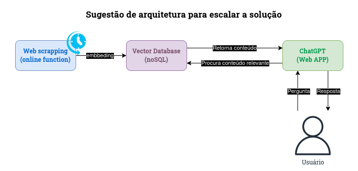

## Challenge #1 **🧩**


🎯 Esse projeto foi desenvolvido com o objetivo de resolver um desafio proposto pela FURIA na criação de um ambiente onde os fãs da FURIA CS pudessem usufuir, utilizando um assitente que retorna respostas customizadas e os atualizam sobre a equipe.


### **Tecnologias utilizadas 💡**

---

O projeto foi todo desenvolvido em python, utilizando Streamlit, OpenAI, Faiss, LangChain, Pydantic, Playwright, BeautifulSoup e Docker


### Estrutura de pastas **📂**

```sh

├── Dockerfile
├── README.md
├── requirements.txt
└── src
    ├── data
    │   ├── docs.index
    │   ├── documents.json
    │   ├── results2.json
    ├── images
    │   ├── avatar.png
    ├── utils
    │   ├── embbedings.py
    │   ├── web_scraping.py
    └── main_with_rag.py

```

- **Dockerfile:** contém as definições do container (Docker).
- **requirements.txt:** arquivo com todos os pacotes necessários para rodar este projeto.
- **docs.index:** contém os dados com embbeding de documentos, que pode ser usado para mapear o conteúdo e facilitar a busca e análise de documentos no sistema.
- **documents.json:** contém os dados curados.
- **result2.json:** armazena os resultados brutos do web scraping.
- **avatar.png:** imagem utilizada para estilizar o chat.
- **embbedings.py:** arquivo que utiliza a biblioteca da OpenAI para fazer o embbeding dos textos a partir de um arquivo JSON.
- **web_scraping.py:** arquivo que realiza o scraping das informações das páginas webs de uma forma estruturada.
- **main_with_rag.py:** arquivo principal que cria um assistente interativo.

### Início rápido

----

*Pré requisitos*

- Ter o python 3.10 ou superior instalada.
- Ter uma api key do OpenAI ativa.

Intruções:

1. Abra o terminal dentro do diretório do projeto.

2. Instale as dependências do projeto, aqui o ideal é ter um ambiente virtual já criado.

    `pip install -r requirements.txt`

3. Após a isntalação das depências, rodar os seguintes comandos: 

    ` Para fazer o scraping da página: python3 web_scraping.py`

    ` Após o scraping, realizar o embbeding: python3 embbedings.py`

   **Obs.:** Caso queira utilizar os arquivos que já estão na pasta src/data, pule esta etapa.

4 - Suba a aplicação: 

    `streamlit run main_with_rag.py`

Esta aplicação foi testa nas versões Python 3.10.0 e 3.12.2

Caso não tenha a versões acima disponíveis e/ou prefira rodar em docker, criei um Dockerfile para executar a aplicação. Execute os seguintes comandos na raíz do repositório para subir a aplicação:

`docker build -t myapp .`

`docker run -d -p 8501:8501 myapp `

Acesse a aplicação localmente pelo link: http://localhost:8501/

5 - Após abrir a página insira a sua api key do openai na barra lateral.

### **Arquitetura**

---



### **Demo**

---

<a href="https://drive.google.com/file/d/1PdqK0EXMh-62FsJPYbb4Y87yIhTkRm0q/view?usp=drive_link">Link vídeo demo</a>

### **Landing Page**

---

<a href="https://furia-challenge-specializedchat.streamlit.app/">Link landing page</a>
